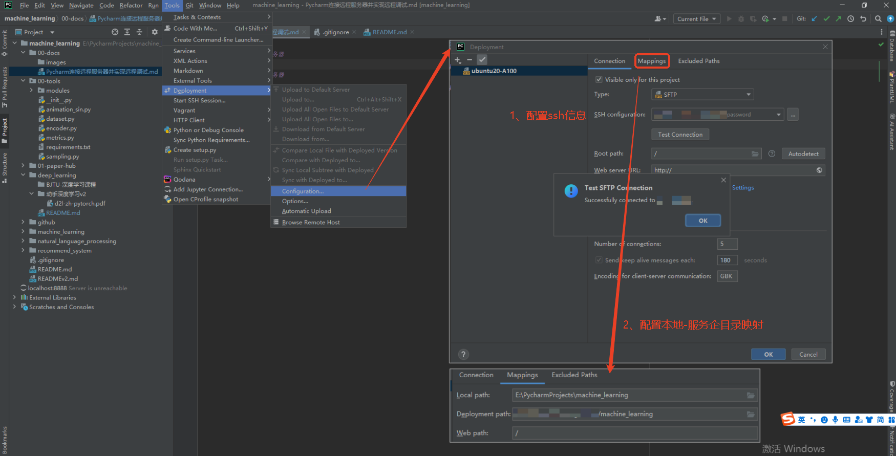
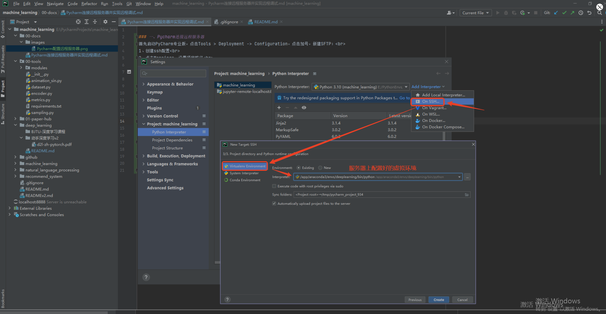

### 一、Pycharm连接远程服务器
首先启动PyCharm专业版，点击Tools > Deployment -> Configuration，点击加号，新建SFTP： 
1、创建ssh配置 
2、点击Mappings，设置项目路径 

 

3、设置Tools-Options  
勾选create empty directories，这样就可以在同步代码时自动创建文件夹 

### 二、配置Python远程解释器
点击 File -> Settings -> Python interpreter（解释器）
1、选择Add，后续新建完成后可通过show all查看并修改相关信息
2、选择SSH解释器，然后可以从存在的服务器里直接选择上一步配置好的服务器
3、选择服务器python和项目的路径

 

### 参考引用
[1] [如何使用PyCharm连接GPU服务器运行代码](https://blog.csdn.net/weixin_42496865/article/details/124271402) 
