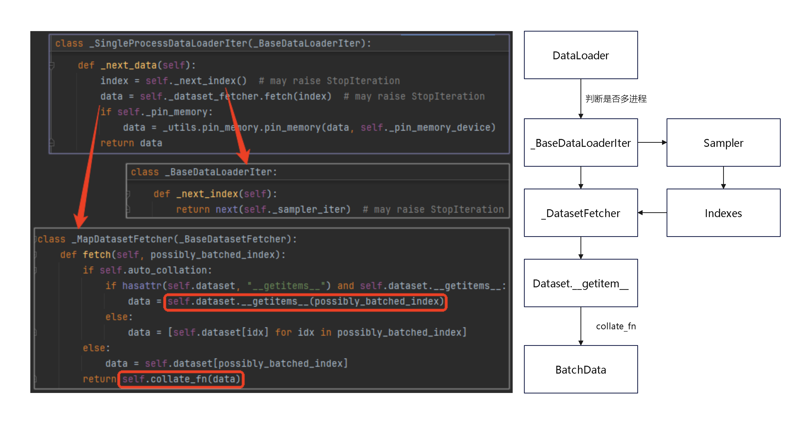

<nav>
<a href="#一pytorch-数据模块">一、PyTorch 数据模块</a><br/>
&nbsp;&nbsp;&nbsp;&nbsp;<a href="#11-dataset">1.1 Dataset</a><br/>
&nbsp;&nbsp;&nbsp;&nbsp;&nbsp;&nbsp;&nbsp;&nbsp;<a href="#111-映射风格数据集map-style-datasets">1.1.1 映射风格数据集（Map-style datasets）</a><br/>
&nbsp;&nbsp;&nbsp;&nbsp;&nbsp;&nbsp;&nbsp;&nbsp;<a href="#112-可迭代数据集iterable-style-datasets">1.1.2 可迭代数据集（Iterable-style datasets）</a><br/>
&nbsp;&nbsp;&nbsp;&nbsp;<a href="#12-dataloader">1.2 DataLoader</a><br/>
&nbsp;&nbsp;&nbsp;&nbsp;<a href="#13-dataset创建数据集">1.3 Dataset创建数据集</a><br/>
<a href="#参考引用">参考引用</a><br/>
</nav>


## 一、PyTorch 数据模块
PyTorch 通常使用 Dataset 和 DataLoader 这两个工具类来构建数据管道。
Dataset 定义了数据集的内容，类似于列表或字典等数据结构，具有确定的长度，支持通过索引访问数据集中的元素，从而实现索引到样本的映射。
DataLoader 负责高效地按批次加载数据，支持数据预处理和并行加载。DataLoader 包含两个核心组件：Sampler 和 Dataset。
Sampler 决定如何生成数据的索引顺序（如随机采样、顺序采样等），而 Dataset 根据 Sampler 提供的索引从数据集中提取对应的样本。

### 1.1 Dataset
PyTorch提供了两种数据集定义方式：映射式数据集、可迭代数据集。

#### 1.1.1 映射风格数据集（Map-style datasets）
映射式数据集是实现了 `__getitem__()` 和 `__len__()` 协议的数据集，它表示从索引（可能是非整数） 或键到数据样本的映射。
在加载数据时，PyTorch将自动使用迭代索引作为key，通过字典索引的方式获取value，本质就是将数据集定义为一个字典。

```python
import random
from torch.utils.data import Dataset, DataLoader, Sampler

class KeyMappedDataset(Dataset):
    def __init__(self, data: list):
        self.data = data
    def __getitem__(self, index):
        return self.data[index]
    def __len__(self):
        return len(self.data)

class MySampler(Sampler):
    def __init__(self, datasource):
        super().__init__(datasource)
        self.datasource = datasource
        self.indices = list(range(len(datasource)))  # 获取数据的索引
        random.seed(1024)
        random.shuffle(self.indices)  # 打乱索引顺序
    def __iter__(self):
        # 通过打乱后的索引顺序迭代数据
        for idx in self.indices:
            yield idx
    def __len__(self):
        return len(self.datasource)


_data = ['张三', '李四']
_dataset = KeyMappedDataset(_data)
for item in DataLoader(_dataset, batch_size=2, shuffle=True): # 输出 ['张三', '李四']
    print(item)

_sampler = MySampler(_data)
for item in DataLoader(_dataset, batch_size=2, sampler=_sampler): # 输出 ['李四', '张三']
    print(item)
```
映射式数据集的特点就是可以通过索引或键来访问数据，从而在不同的应用场景中更加灵活。<br>
**注意**：<br>
1、每个采样器子类必须提供一个__iter__方法，提供一种迭代数据集元素的索引的方法，以及返回迭代器长度的__len__方法。<br>
2、当shuffle为true，且sampler为None时，采样器默认使用`RandomSampler`。<br>

#### 1.1.2 可迭代数据集（Iterable-style datasets）
迭代器风格。在自定义数据集类中，实现`__iter__()`方法，即定义为迭代器。
在后续加载数据迭代时，pytorch将依次获取value，使用这种风格时，需要继承IterableDataset类。
```python
from torch.utils.data import IterableDataset, DataLoader

class MyIterableDataset(IterableDataset):
    def __init__(self, data):
        super(MyIterableDataset).__init__()
        self.data = data
    def __iter__(self):
        for i in self.data:
            yield i

_data = ['张三', '李四']
_dataset = MyIterableDataset(_data)
for item in DataLoader(_data, batch_size=2): # 输出 ['张三', '李四']
    print(item)

for item in DataLoader(MyIterableDataset(_data), batch_size=2, shuffle=True):
    print(item)
# ValueError: DataLoader with IterableDataset: expected unspecified shuffle option, but got shuffle=True
```
IterableDataset 在处理大数据集时确实比 Dataset 更有优势，尤其适用于不能一次性加载到内存中的数据集。
然而，IterableDataset 在迭代过程中并没有固定的输出顺序，默认情况下，如果没有实现自定义的打乱机制，样本顺序是按照数据流的顺序输出的。
而且，由于 IterableDataset 并不强制要求实现 __len__() 方法（有时数据总量无法获取），因此不能通过 len() 获取数据集的总量，不能直接使用 DataLoader 中的 shuffle=True 来打乱数据。
如果需要打乱数据，需要在 IterableDataset 中实现自定义的打乱机制。<br>

**注意**：sampler 和 batch_sampler 都不兼容可迭代数据集，因为此类数据集没有键或索引的概念。

### 1.2 DataLoader
DataLoader的功能是构建可迭代的数据装载器，在训练的时候，每一个for循环，每一次Iteration，就是从DataLoader中获取一个batch_size大小的数据，节省内存的同时，它还可以实现多进程、数据打乱等处理。
DataLoader数据读取机制如下图所示：<br>

<br>

在for循环中使用了DataLoader，进入DataLoader后，通过判断是否使用多进程来选择单线程或多线程加载数据，得到_xxDataLoaderIter对象。
接着，Sampler 生成数据索引并传递给 DatasetFetcher，然后通过 Dataset 的 __getitem__ 获取数据和标签，最终通过 collate_fn 整理数据形成批次，并将批次数据输入到模型进行训练。<br>

在pytorch建模的数据处理、加载流程中，DataLoader算是最核心的一步，常用的几个参数如下：
```python
DataLoader(dataset, batch_size=1, shuffle=False, sampler=None, num_workers=0, 
           collate_fn=<function default_collate>, pin_memory=False, drop_last=False)

dataset (Dataset)               – 加载数据的数据集。
batch_size (int, optional)      – 每个batch加载多少个样本(默认: 1)。
shuffle (bool, optional)        – 设置为True时会在每个epoch重新打乱数据(默认: False).
sampler (Sampler, optional)     – 定义从数据集中提取样本的策略。如果指定，则忽略shuffle参数。
num_workers (int, optional)     – 用多少个子进程加载数据。0表示数据将在主进程中加载(默认: 0)
collate_fn (callable, optional) –
pin_memory (bool, optional)     –
drop_last (bool, optional)      – 如果数据集大小不能被batch size整除，则设置为True后可删除最后一个不完整的batch。
                                  如果设为False并且数据集的大小不能被batch size整除，则最后一个batch将更小。(默认: False)
```

### 1.3 Dataset创建数据集

Dataset创建数据集常用的方法有：
+ 使用 torch.utils.data.`TensorDataset` 根据Tensor创建数据集(numpy的array，Pandas的DataFrame需要先转换成Tensor)。
+ 使用 torchvision.datasets.ImageFolder 根据图片目录创建图片数据集。<br>
+ 继承 torch.utils.data.Dataset 创建自定义数据集。<br>

此外，还可以通过
+ torch.utils.data.`random_split` 将一个数据集分割成多份，常用于分割训练集，验证集和测试集。<br>
+ 调用Dataset的加法运算符(+)将多个数据集合并成一个数据集。<br>

注意：TensorDataset通过每一个 tensor 的第一个维度进行索引，因此，该类中的 tensor 第一维度必须相等。

```python
import torch
import numpy as np
from torch.utils.data import TensorDataset, random_split, DataLoader

# x, y
_dataset = TensorDataset(torch.tensor(np.random.randint(low=1, high=10, size=(10, 5))), 
                         torch.tensor(np.random.randint(low=1, high=10, size=(10, 1))))

# 查看数据集大小
print(len(_dataset))  # 10

# 划分训练集、测试集
tra_size = int(len(_dataset) * 0.8)
val_size = len(_dataset) - tra_size
generator = torch.Generator().manual_seed(0)

_tra_dataset, _val_dataset = random_split(_dataset, [tra_size, val_size], generator=generator)
print(len(_tra_dataset), len(_val_dataset)) # 8 2

# 按批加载
device = torch.device("cuda" if torch.cuda.is_available() else "cpu")
_tra_dataloader = DataLoader(_tra_dataset, batch_size=4, shuffle=True)
for batch_idx, (x, y) in enumerate(_tra_dataloader):
    data, labels = x.to(device), y.to(device)  # 将数据和标签移到 GPU
    print(f"Batch {batch_idx + 1}: x device: {data.device}, y device: {labels.device}")

# Batch 1: x device: cuda:0, y device: cuda:0
# Batch 2: x device: cuda:0, y device: cuda:0
```


## 参考引用

[1] [Pytorch建模过程中的DataLoader与Dataset](https://www.cnblogs.com/chenhuabin/p/17026018.html)<br>
[2] [《深入浅出PyTorch》](https://github.com/datawhalechina/thorough-pytorch)<br>
[3] [20天吃掉那只Pytorch-5-1, Dataset和DataLoader](https://jackiexiao.github.io/eat_pytorch_in_20_days/5.%E4%B8%AD%E9%98%B6API/5-1%2CDataset%E5%92%8CDataLoader/)<br>
[4] [PyTorch官方文档-data](https://pytorch.org/docs/stable/data.html)<br>
[5] [PyTorch中文文档-data](https://pytorch-cn.readthedocs.io/zh/latest/package_references/data/)<br>
[6] [《PyTorch实用教程》（第二版）](https://github.com/TingsongYu/PyTorch-Tutorial-2nd/releases/tag/v1.0.0)<br>
[7] [《动手学深度学习v2》](https://zh-v2.d2l.ai/)<br>

