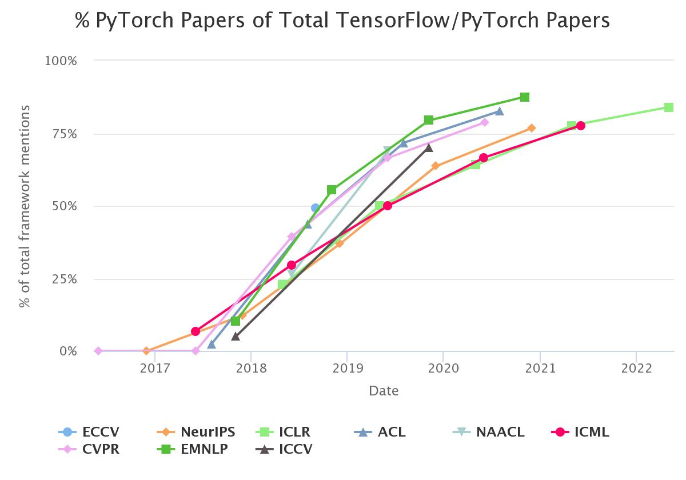

<nav>
<a href="#一pytorch-初认识">一、PyTorch 初认识</a><br/>
&nbsp;&nbsp;&nbsp;&nbsp;<a href="#11-pytorch历史">1.1 PyTorch历史</a><br/>
&nbsp;&nbsp;&nbsp;&nbsp;<a href="#12-pytorch发展趋势">1.2 PyTorch发展趋势</a><br/>
&nbsp;&nbsp;&nbsp;&nbsp;<a href="#13-环境配置">1.3 环境配置</a><br/>
<a href="#参考引用">参考引用</a><br/>
</nav>


### 一、PyTorch 初认识

#### 1.1 PyTorch历史
PyTorch 是 Facebook AI Research (FAIR) 于 2017 年发布的深度学习框架，其名称结合了 Python 和早期的深度学习框架 Torch。
Torch 是纽约大学在 2002 年开发的框架，最初采用小众的 Lua 语言作为接口，使用门槛较高，因此团队后续用 Python 语言对其进行了重构，最终诞生了 PyTorch。

PyTorch 的关键发展历程包括：
+ 2016 年 8 月，发布第一个公开版本 v0.1.1。
+ 2017 年 1 月，正式发布 PyTorch。
+ 2018 年 4 月，更新 0.4.0 版，支持 Windows 系统。
+ 2018 年 11 月，发布 1.0 稳定版，成为 GitHub 上增长第二快的开源项目。
+ ...

截止到 2024 年 10 月，FAIR发布了PyTorch 2.5.1。[PyTorch-releases](https://github.com/pytorch/pytorch/releases)


#### 1.2 PyTorch发展趋势

通过学术界论文的趋势可以看出，PyTorch是未来的大势所趋。
虽然在早期工业部署方面不如TensorFlow，但如今PyTorch推出了libtorch、TorchServe等工具，以及如TensorRT、OpenVINO、ONNX等兼容性良好的部署框架，这些都显著提升了PyTorch的部署能力。
PyTorch如今已经在学术界占据主导地位，新模型基本都是用PyTorch实现，工业界开发者为应用最新的算法和模型，也只能纷纷转向PyTorch。
选择PyTorch进行深度学习、机器学习开发，不仅加速模型开发，还充分体现了PyTorch的主旨：`An open source machine learning framework that accelerates the path from research prototyping to production deployment`.<br>

<br>


#### 1.3 环境配置

+ 使用镜像
```shell
nvidia/cuda:12.2.2-cudnn8-runtime-ubuntu22.04
```

+ 系统版本：lsb_release -a
```
Distributor ID: Ubuntu
Description:    Ubuntu 22.04.3 LTS
Release:        22.04
Codename:       jammy
```

+ 显卡版本(虚拟机)：nvidia-smi
```
+-----------------------------------------------------------------------------+
| NVIDIA-SMI 470.82.01    Driver Version: 470.82.01    CUDA Version: 12.2     |
|-------------------------------+----------------------+----------------------+
| GPU  Name        Persistence-M| Bus-Id        Disp.A | Volatile Uncorr. ECC |
| Fan  Temp  Perf  Pwr:Usage/Cap|         Memory-Usage | GPU-Util  Compute M. |
|                               |                      |               MIG M. |
|===============================+======================+======================|
|   0  NVIDIA A100-PCI...  Off  | 00000000:36:00.0 Off |                    0 |
| N/A   37C    P0    42W / 250W |      0MiB / 20268MiB |      0%      Default |
|                               |                      |             Disabled |
+-------------------------------+----------------------+----------------------+
```

+ Miniconda创建虚拟环境
```
conda create -n deeplearning python==3.10.12
conda activate deeplearning
cd $HOME/machine_learning
python -m pip install -r requirements.txt -i https://mirrors.tuna.tsinghua.edu.cn/pypi/web/simple

(deeplearning) root@recllm:/data# python
>>> import torch
[HAMI-core Msg(46408:140098104814464:libvgpu.c:836)]: Initializing.....
>>> torch.__version__
'2.4.0+cu121'

# jupyter 地址
nohup jupyter notebook --allow-root --no-browser --port 8088 &
```

### 参考引用

[1] [《PyTorch实用教程》（第二版）](https://github.com/TingsongYu/PyTorch-Tutorial-2nd/releases/tag/v1.0.0)<br>
[2] [PyTorch 2.4.0](https://pytorch.org/get-started/previous-versions/#v240)<br>
[3] [PyTorch中文文档](https://www.bookstack.cn/read/PyTorch-cn/README.md)<br>
