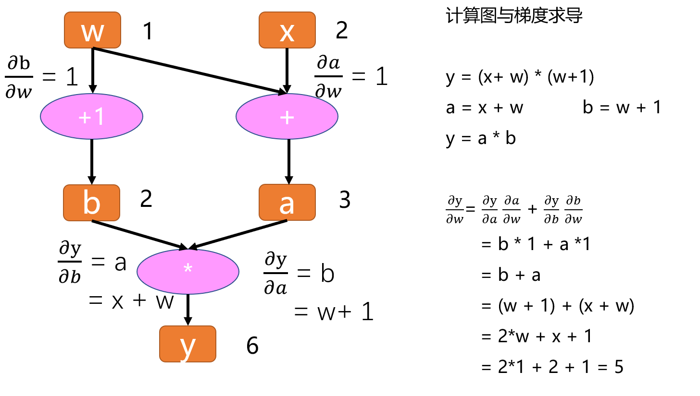

<nav>
<a href="#一pytorch-核心模块">一、PyTorch 核心模块</a><br/>
&nbsp;&nbsp;&nbsp;&nbsp;<a href="#11-模块结构">1.1 模块结构</a><br/>
&nbsp;&nbsp;&nbsp;&nbsp;<a href="#12-核心数据结构-tensor">1.2 核心数据结构 Tensor</a><br/>
&nbsp;&nbsp;&nbsp;&nbsp;&nbsp;&nbsp;&nbsp;&nbsp;<a href="#121-基本概念">1.2.1 基本概念</a><br/>
&nbsp;&nbsp;&nbsp;&nbsp;&nbsp;&nbsp;&nbsp;&nbsp;<a href="#122-创建张量">1.2.2 创建张量</a><br/>
&nbsp;&nbsp;&nbsp;&nbsp;&nbsp;&nbsp;&nbsp;&nbsp;<a href="#123-操作张量">1.2.3 操作张量</a><br/>
&nbsp;&nbsp;&nbsp;&nbsp;&nbsp;&nbsp;&nbsp;&nbsp;&nbsp;&nbsp;&nbsp;&nbsp;<a href="#a-算术操作">(1) 算术操作</a><br/>
&nbsp;&nbsp;&nbsp;&nbsp;&nbsp;&nbsp;&nbsp;&nbsp;&nbsp;&nbsp;&nbsp;&nbsp;<a href="#b-索引">(2) 索引</a><br/>
&nbsp;&nbsp;&nbsp;&nbsp;&nbsp;&nbsp;&nbsp;&nbsp;&nbsp;&nbsp;&nbsp;&nbsp;<a href="#c-切片index_select">(3) 切片（index_select）</a><br/>
&nbsp;&nbsp;&nbsp;&nbsp;&nbsp;&nbsp;&nbsp;&nbsp;&nbsp;&nbsp;&nbsp;&nbsp;<a href="#d-维度变换">(4) 维度变换</a><br/>
&nbsp;&nbsp;&nbsp;&nbsp;&nbsp;&nbsp;&nbsp;&nbsp;&nbsp;&nbsp;&nbsp;&nbsp;<a href="#e-gather">(5) gather</a><br/>
&nbsp;&nbsp;&nbsp;&nbsp;&nbsp;&nbsp;&nbsp;&nbsp;&nbsp;&nbsp;&nbsp;&nbsp;<a href="#f-广播机制">(6) 广播机制</a><br/>
&nbsp;&nbsp;&nbsp;&nbsp;&nbsp;&nbsp;&nbsp;&nbsp;&nbsp;&nbsp;&nbsp;&nbsp;<a href="#g-tensor和numpy相互转换">(7) Tensor和NumPy相互转换</a><br/>
&nbsp;&nbsp;&nbsp;&nbsp;&nbsp;&nbsp;&nbsp;&nbsp;&nbsp;&nbsp;&nbsp;&nbsp;<a href="#8-降维">(8) 降维</a><br/>
&nbsp;&nbsp;&nbsp;&nbsp;&nbsp;&nbsp;&nbsp;&nbsp;<a href="#124-自动求导">1.2.4 自动求导</a><br/>
&nbsp;&nbsp;&nbsp;&nbsp;&nbsp;&nbsp;&nbsp;&nbsp;&nbsp;&nbsp;&nbsp;&nbsp;<a href="#a-计算图概念">(1) 计算图概念</a><br/>
&nbsp;&nbsp;&nbsp;&nbsp;&nbsp;&nbsp;&nbsp;&nbsp;&nbsp;&nbsp;&nbsp;&nbsp;<a href="#b-autograd">(2) Autograd</a><br/>
&nbsp;&nbsp;&nbsp;&nbsp;<a href="#参考引用">参考引用</a><br/>
</nav>


## 一、PyTorch 核心模块

### 1.1 模块结构
模块代码位置：$ENS/deeplearning/Lib/site-packages/torch

| 模块                        | 功能说明                                                     |
|---------------------------|----------------------------------------------------------|
| `torch`                   | PyTorch 的主库，提供 tensor 操作、数学运算、GPU 加速等基本功能                |
| `torch.nn`                | 构建神经网络的核心模块，包含卷积、批归一化、激活、全连接、损失函数等。                      |
| `torch.nn.functional`     | 提供神经网络常用函数，如卷积、池化、激活等，功能与 `torch.nn` 中的类一致。              |
| `torch.nn.init`           | 提供神经网络参数初始化的常见策略，如常量初始化、均匀分布初始化、正态分布初始化等。                |
| `torch.optim`             | 优化器模块，提供多种优化算法（如 SGD、Adam、Adagrad 等）                     |
| `torch.autograd`          | 自动求导模块，用于自动计算模型参数的梯度                                     |
| `torch.autograd.backward` | 主要用于在求得损失函数之后进行反向梯度传播，计算梯度并更新模型参数。                       |
| `torch.autograd.grad`     | 用于计算一个标量对另一个张量的导数，并支持在计算过程中设置不参与求导的部分。                   |
| `torch.utils.data`        | 数据处理模块，提供 `DataLoader` 和 `Dataset`，简化数据加载与处理             |
| `torch.utils.tensorboard` | 用于与 TensorBoard 交互的工具，支持记录和可视化训练过程中的标量、图像、损失函数等信息        |
| `torch.cuda`              | GPU 加速模块，提供与 GPU 相关的操作                                   |
| `torch.jit`               | 即时编译器，把 Pytorch 的动态图转换成可以优化和序列化的静态图，能被 C++ 和 Java 等语言调用。 |
| `torch.onnx`              | 定义了 Pytorch 导出和加载 ONNX格式的深度学习模型描述文件，便于跨框架使用模型。           |
| `torch.multiprocessing`   | 多进程 API，可以启动不同的进程，每个进程运行不同的深度学习模型，并且能够在进程间共享张量。          |

### 1.2 核心数据结构 Tensor

#### 1.2.1 基本概念
张量（Tensor）是一个多维数组，它是标量、向量和矩阵的拓展。标量是零维张量，向量是一维张量，矩阵是二维张量，如一个RGB图像的数组就是一个三维张量（高、宽、颜色通道）。<br>

在 PyTorch 中，有两个张量的相关概念容易混淆，分别是 `torch.Tensor` 和 `torch.tensor`：
- `torch.Tensor` 是一个类，用于表示张量数据结构。
- `torch.tensor` 是一个函数，用于将列表、元组、NumPy ndarray、标量等数据类型转换为张量，通常我们使用 `torch.tensor` 来创建张量。

张量的作用是表达 PyTorch 中各类数据（如输入数据、模型参数、特征图、输出等），并且与自动求导紧密相关。通过 `autograd`，张量能够记录计算历史并计算梯度，这是深度学习模型训练中必不可少的功能。
在 PyTorch 0.4.0 版本之前，张量需要通过 `Variable` 进行包装，才能实现自动求导。自 0.4.0 版本起，`torch.Tensor` 类和 `torch.autograd.Variable` 合并，`Tensor` 类直接支持梯度计算，因此不再需要额外的 `Variable` 包装。<br>

张量的主要属性：
- `data`: 存储具体的多维数组数据，是张量的核心属性。
- `dtype`: 张量的数据类型（如 `float32`、`int64` 等）。
- `shape`: 张量的形状。
- `device`: 张量所在的设备，CPU 或 CUDA。
- `grad`: 存储张量的梯度。
- `grad_fn`: 记录生成该张量的操作函数。
- `is_leaf`: 标记张量是否为计算图的叶子节点。
- `requires_grad`: 标记该张量是否需要计算梯度。

#### 1.2.2 创建张量
+ 直接创建
```
# 创建一个2x3的未初始化的Tensor
x1 = torch.empty(2, 3)
# 创建一个2x3的随机初始化的Tensor
x2 = torch.rand(2,3)
# 创建一个2x3的long型全0的Tensor
x3 = torch.zeros(2, 3, dtype=torch.long)
# 为每一个元素以给定的mean和std用高斯分布生成随机数
x4 = torch.normal(mean=0.5, std=torch.arange(1., 6.))
# randn 服从N(0，1)的正态分布
x5 = torch.randn(2, 3)

x1, x2, x3, x4, x5
(tensor([[-5.5342e+16,  4.5590e-41,  1.4298e-31],
         [ 0.0000e+00,  4.4842e-44,  0.0000e+00]]),
 tensor([[0.0416, 0.4603, 0.0316],
         [0.0257, 0.8035, 0.7237]]),
 tensor([[0, 0, 0],
         [0, 0, 0]]),
 tensor([1.7151, 0.7471, 0.7103, 0.3743, 1.1443])
 tensor([[-1.7507, -0.7708, -0.1977],
         [ 1.7947,  2.4549, -0.1717]]))
```

+ 根据不同数据类型创建
```
x1 = torch.tensor([[5,5,3], [2,2,5]])
x2 = torch.tensor(np.array([[1, 2, 3], [4, 5, 6]]))
x3 = torch.from_numpy(np.array([[1, 2, 3], [4, 5, 6]]))
x1, x2, x3

(tensor([[5, 5, 3],
         [2, 2, 5]]),
 tensor([[1, 2, 3],
         [4, 5, 6]]),
 tensor([[1, 2, 3],
         [4, 5, 6]]))
```
+ 从已有张量创建
```
x = torch.tensor([[1,2,3], [4,5,6]])
# 返回的tensor默认具有相同的torch.dtype和torch.device 
x1 = x.new_ones(2, 3, dtype=torch.float64)
# 指定新的数据类型
x2 = torch.randn_like(x, dtype=torch.float, device='cuda')
x1, x2

(tensor([[1., 1., 1.],
         [1., 1., 1.]], dtype=torch.float64),
 tensor([[ 1.2797, -0.0880,  1.2151],
         [ 1.1600, -0.2267,  0.4583]], device='cuda:0'))
```

#### 1.2.3 操作张量
PyTorch中的 Tensor 支持超过一百种操作，包括转置、索引、切片、数学运算、线性代数、随机数等等，具体使用方法可参考[官方文档](https://pytorch.org/docs/stable/tensors.html)。

##### (1) 算术操作
```
x = torch.ones(2, 3) 
y = torch.eye(2, 3)
# 加法形式1
s1 = x + y
# 加法形式2
s2 = torch.add(x, y)
# 加法形式3，inplace(原地操作)，原值修改
s3 = y.add_(x)
x, y, s1, s2, s3, y

(tensor([[1., 1., 1.],
         [1., 1., 1.]]),
 tensor([[2., 1., 1.],
         [1., 2., 1.]]),
 tensor([[2., 1., 1.],
         [1., 2., 1.]]),
 tensor([[2., 1., 1.],
         [1., 2., 1.]]),
 tensor([[2., 1., 1.],
         [1., 2., 1.]]),
 tensor([[2., 1., 1.],
         [1., 2., 1.]]))
```
##### (2) 索引
索引出来的结果与原数据`共享内存`，也即修改一个，另一个会跟着修改。
```
x = torch.ones(2, 3, device='cuda') 
y = x[0, :]
y += 1

x, y, x[0, :]
(tensor([[2., 2., 2.],
         [1., 1., 1.]], device='cuda:0'),
 tensor([2., 2., 2.], device='cuda:0'),
 tensor([2., 2., 2.], device='cuda:0'))
```
##### (3) 切片（index_select）
沿着指定维度对输入进行切片，取index中指定的相应项(index 为一个 LongTensor)，然后返回到一个新的张量， 返回的张量与原始张量 Tensor 有相同的维度(在指定轴上)。<br>
注意： `返回的张量不与原始张量共享内存空间`。<br>
```
torch.index_select(input: Tensor, dim: _int, index: Tensor, *, out: Optional[Tensor] = None) -> Tensor: 
    input (Tensor)         – 输入张量
    dim (int)              – 索引的轴
    index (LongTensor)     – 包含索引下标的一维张量
    out (Tensor, optional) – 目标张量
```
```
x = torch.randn(3, 4)
indices = torch.LongTensor([0, 2])
y = torch.index_select(x, 0, indices)
x, indices, y

(tensor([[ 0.1912,  0.1199, -0.0856, -1.8215],
         [ 0.2932,  0.9630,  0.3461, -0.7105],
         [-1.2408, -1.6029,  0.8402,  0.3389]]),
 tensor([0, 2]),
 tensor([[ 0.1912,  0.1199, -0.0856, -1.8215],
         [-1.2408, -1.6029,  0.8402,  0.3389]]))
```
##### (4) 维度变换
张量的维度变换常见的方法有torch.view()和torch.reshape()
1. `view()`<br>
注意view()**返回的新Tensor与源Tensor虽然可能有不同的size**，但`共享data`。<br>
即更改其中的一个，另外一个也会跟着改变。(顾名思义，view仅仅是改变了对这个张量的 观察角度，内部数据并未改变)
2. `reshape()` 和 `clone()`<br> 
Pytorch还提供了一个 reshape() 方法可以改变形状，但是此函数并不能保证返回的是其拷贝，所以不推荐使用。<br> 
推荐先用 clone() 创造一个副本然后再使用view()。

```
x = torch.ones(2, 4)
# 一个tensor必须是连续的contiguous()才能被查看。
# 一开始不加contiguous()，报 “view size is not compatible ... ” 错误
y1 = x.view(8)
y2 = x.view(-1, 8) # -1所指的维度可以根据其他维度的值推出来

x, y1, y2, x.size(), y1.size(), y2.size()
(tensor([[1., 1., 1., 1.],
         [1., 1., 1., 1.]]),
 tensor([1., 1., 1., 1., 1., 1., 1., 1.]),
 tensor([[1., 1., 1., 1., 1., 1., 1., 1.]]),
 torch.Size([2, 4]),
 torch.Size([8]),
 torch.Size([1, 8]))
```
注: torch.view() 返回的新tensor与源tensor`共享内存`(其实是同一个tensor)，更改其中的一个，另外一个也会跟着改变。(顾名思义，view()仅仅是改变了对这个张量的观察角度)
```
x += 1
print(x)
print(y1) # 也加了1

tensor([[2., 2., 2., 2.],
        [2., 2., 2., 2.]])
tensor([2., 2., 2., 2., 2., 2., 2., 2.])
```
torch.view()会改变原始张量，但是很多情况下，我们希望原始张量和变换后的张量互相不影响。为了使创建的张量和原始张量不共享内存，我们需要使用第二种方法torch.reshape()， 同样可以改变张量的形状，但是此函数并不能保证返回的是其拷贝值，所以官方不推荐使用。推荐的方法是我们先用 `clone()` 创造一个张量副本然后再使用 `torch.view()`进行函数维度变换。<br>
注：使用 clone() 还有一个好处是会被记录在计算图中，即梯度回传到副本时也会传到源 Tensor 。 
```
x1 = x.clone()
y3 = x.view(-1)
x1 += 1

x1, y3
(tensor([[3., 3., 3., 3.],
         [3., 3., 3., 3.]]),
 tensor([2., 2., 2., 2., 2., 2., 2., 2.]))
```


##### (5) gather
`torch.gather(input, dim, index, out=None)`<br>
官方定义：沿给定轴dim，将输入索引张量index指定位置的值进行聚合。<br>
通俗理解：给定轴dim，在input中，根据index指定的下标，选择元素重组成一个新的tensor，最后输出的out与index的size是一样的。<br>

对一个3维张量，输出可以定义为<br>
```
out[i][j][k] = tensor[index[i][j][k]][j][k] # dim=0
out[i][j][k] = tensor[i][index[i][j][k]][k] # dim=1
out[i][j][k] = tensor[i][j][index[i][j][k]] # dim=3
```
```
_input = torch.tensor([[0.9, 0, 0], [0, 0.6, 0],[0, 0.7, 0]])
index = torch.tensor([0, 1, 1])
_input, index, index.view(-1, 1)
(tensor([[0.9000, 0.0000, 0.0000],
         [0.0000, 0.6000, 0.0000],
         [0.0000, 0.7000, 0.0000]]),
 tensor([0, 1, 1]),
 tensor([[0],
         [1],
         [1]]))

_input.gather(dim=1, index=index.view(-1, 1))
# dim=1，表示的是在第二维度上操作。
# 在index中，[0]表示第一行对应元素的下标，即[0.9]
#           [1]表示第二行对应元素的下标，即[0.6]
#           [1]表示第三行对应元素的下标，即[0.7]
tensor([[0.9000],
        [0.6000],
        [0.7000]])
```

##### (6) 广播机制
当我们对两个形状不同的Tensor按元素运算时，可能会触发`广播(broadcasting)机制`。 <br>
先适当复制元素使这两个Tensor形状相同后再按元素运算。
```
# x 中第一行的2个 元素被广播(复制)到了第二行和第三行
# y 中第一列的3个元素被广播(复制)到 了第二列
x = torch.arange(1, 3).view(1, 2)
y = torch.arange(1, 4).view(3, 1)

x, y, x+y
(tensor([[1, 2]]),
 tensor([[1],
         [2],
         [3]]),
 tensor([[2, 3],
         [3, 4],
         [4, 5]]))
```

##### (7) Tensor和NumPy相互转换
`numpy()`和`from_numpy()`
+ 这两个函数所产生的的Tensor和NumPy中的数组共享相同的内存(所以他们之间的转换很快)，改变其中一个时另一个也会改变!

`torch.tensor()`
+ 进行**数据拷贝**，所以返回的Tensor和原来的数据不再共享内存。

```
# Tensor转NumPy数组
x = torch.ones(3)
y = x.numpy()
x += 1
y += 1
print(x, y)

# NumPy数组转 Tensor
x = np.ones(3)
y = torch.from_numpy(x)
x += 1
y += 1

print(x, y)
tensor([3., 3., 3.]) [3. 3. 3.]
[3. 3. 3.] tensor([3., 3., 3.], dtype=torch.float64)
```

使用torch.tensor()将NumPy数组转换成Tensor(不再共享内存)
```
x = np.ones(3)
y = torch.tensor(x)
x += 1

print(x, y)
[2. 2. 2.] tensor([1., 1., 1.], dtype=torch.float64)
```

##### (8) 降维
在 PyTorch 中，对张量进行聚合操作时（例如求和或求均值），默认情况下，会调用相关函数沿指定的轴进行聚合，并降低张量的维度。例如：<br>
指定 axis=0：沿轴 0 汇总所有行的元素降维（轴0），因此，输入轴0的维数在输出形状中消失。<br>
指定 axis=1：沿轴 1 汇总所有列的元素降维（轴1），因此，输入轴1的维数在输出形状中消失。<br>
全矩阵求和：同时对行和列进行求和，相当于对矩阵的所有元素求和，最终得到一个标量。
```
A = torch.arange(6, dtype=torch.float32).view(3, 2)
print(A)
print(A.shape, A.sum(), A.sum(axis=[0, 1]))

A_sum_axis0 = A.sum(axis=0)
print(A_sum_axis0.shape, A_sum_axis0)

A_sum_axis1 = A.sum(axis=1)
print(A_sum_axis1.shape, A_sum_axis1)

tensor([[0., 1.],
        [2., 3.],
        [4., 5.]])
torch.Size([3, 2]) tensor(15.) tensor(15.)
torch.Size([2]) tensor([6., 9.])
torch.Size([3]) tensor([1., 5., 9.])
```
如果希望保持轴数不变，可以使用 `keepdim=True` 参数。这样就可以保持张量的维度一致，方便后续操作，特别是在进行广播（broadcasting）或者在特定形状的计算中非常有用。
```
A = torch.arange(6, dtype=torch.float32).view(2, 3)
B = torch.arange(6, dtype=torch.float32).view(2, 3)

A_sum_axis0 = A.sum(axis=0)
print(A)
print(A_sum_axis0)
print(B)
print(A_sum_axis0 + B)

tensor([[0., 1., 2.],
        [3., 4., 5.]])
tensor([3., 5., 7.])
tensor([[0., 1., 2.],
        [3., 4., 5.]])
tensor([[ 3.,  6.,  9.],
        [ 6.,  9., 12.]])
```

#### 1.2.4 自动微分
深度学习框架通过自动计算导数，即`自动微分`（automatic differentiation）来加快求导。
实际中，根据设计好的模型，系统会构建一个`计算图`（computational graph），来跟踪计算是哪些数据通过哪些操作组合起来 产生输出。
自动微分使系统能够随后反向传播梯度。这里，`反向传播`（backpropagate）意味着跟踪整个计算图，填充关于每个参数的偏导数。

##### (1) 计算图概念
计算图是一种描述运算的“语言”，由节点（Node）和边（Edge）组成：
- **节点**表示数据，如标量、向量、矩阵、张量等；
- **边**表示运算，如加法、减法、乘法、除法、卷积、ReLU 等。

计算图的作用是记录节点和边的信息，从而方便地完成自动求导。举个例子，假设有一个计算过程：
```
y = (x+ w) * (w+1)
```
将每一步细化为：
```
a = x + w
b = w + 1
y = a * b
```

假设要计算 $y$ 对 $w$ 的导数，在计算图中如何操作呢？<br>

<br>

首先，观察 $w$ 和 $y$ 之间的关系： $w$ 会通过两条路径传递到 $y$ 。一种是通过左边的路径（与 $a$ 相连），另一种是通过右边的路径（与 $b$ 相连）。因此， $y$ 对 $w$ 的偏导数可以通过链式法则表示为：

$$\frac{\partial y}{\partial w} = \frac{\partial y}{\partial a} \cdot \frac{\partial a}{\partial w} + \frac{\partial y}{\partial b} \cdot \frac{\partial b}{\partial w}$$

通过计算图的逐步求导，可以得到最终的结果。

**叶子结点**和**根结点**：
- 在计算图中，所有的偏微分计算所需的数据是基于 $w$ 和 $x$ 的， $w$ 和 $x$ 被称为叶子结点。叶子结点是计算图中的基础结点，它们的数据不是由其他运算生成的，因此它们是整个计算图的基石，不可以轻易修改。
- 最终计算得到的 $y$ 是根结点，类似于树形结构，叶子结点在上，根结点在下。

总结来说，计算图通过层层传递信息和梯度，利用链式法则计算梯度，叶子结点是计算图的基础，而根结点是最终计算结果所在的位置。<br>

计算图根据搭建方式的不同，可以分为静态图和动态图。 **PyTorch** 是典型的动态图，**TensorFlow** 是静态图（但 TensorFlow 2.x 也支持动态图模式）。

1. **运算顺序**：<br>
   **静态图**：先搭建计算图，再进行运算。计算图在运算之前已经完全定义好。<br>
   **动态图**：在运算的同时，计算图是动态生成的。每进行一步计算，计算图会实时构建。

2. **计算图的可变性**：<br>
   **动态图**：计算图在运算过程中是可变动的，可以根据每一步的运算来调整。<br>
   **静态图**：计算图是固定的，不会在运算过程中发生变化。

静态图和动态图优缺点：<br>
1. **动态图优点**：<br>
   **易理解**：程序按照编写的顺序执行，直观且易于调试。<br>
   **灵活性**：可以根据模型的运算结果动态调整计算图，适应不同情况。

2. **静态图优点**：<br>
   **高效性**：在图搭建完成后，可以对计算图进行优化，从而提高运算效率。尤其在GPU时代，这种优化能显著提升性能。<br>
   **适用于大规模生产环境**：静态图常常能够更好地进行并行计算和资源调度。

3. **静态图缺点**：
   **晦涩性**：需要理解 Session、Placeholder 等概念，调试比较困难，灵活性差。

总结来说，静态图和动态图各有优劣，动态图提供了更大的灵活性和易用性，而静态图则在计算效率上有一定优势，适合于大规模部署和优化。

##### (2) Autograd
torch.Tensor 是这个包的核心类。如果设置它的属性 `.requires_grad` 为 True，那么它将会追踪对于该张量的所有操作。
当完成计算后可以通过调用 `.backward()`，来自动计算所有的梯度。这个张量的所有梯度将会自动累加到`.grad`属性。<br>

如果不想要被继续追踪，可以调用`.detach()`将其从追踪记录中分离出来，这样就可以防止将来的计算被追踪。
此外，还可以用`with torch.no_grad()`将不想被追踪的操作代码块包裹起来，这种方法在评估模型的时候很常用，因为在评估模型时，我们并不需要计算可训练参数(requires_grad=True)的梯度。<br>

Tensor和Function互相结合就可以构建一个记录有整个计算过程的**有向无环图(DAG)**。
每个Tensor都有一个`.grad_fn`属性，用来记录创建张量时所用到的运算，在链式求导法则中会使用到，默认是None。<br>

+ 自动求导机制通过有向无环图（directed acyclic graph ，DAG）实现
+ 在DAG中，记录数据（对应tensor.data）以及操作（对应tensor.grad_fn）
+ 操作在pytorch中统称为`Function`，如加法、减法、乘法、ReLU、conv、Pooling等

```
w = torch.tensor([1.], requires_grad=True)
x = torch.tensor([2.], requires_grad=True)
a = torch.add(w, x)
b = torch.add(w, 1)
y = torch.mul(a, b)

 # x是直接创建的，所以它没有grad_fn
print(x.grad_fn)
print(a.grad_fn)
y.backward()
print(w.grad)

None
<AddBackward0 object at 0x7f155bcb23e0>
tensor([5.])
```
grad在反向传播过程中是`累加`的(accumulated)，这意味着每一次运行反向传播，梯度都会累加之前的梯度，所以一般在反向传播之前需把梯度清零。
```
# 注意grad是累加的
y2 = w.sum()
y2.backward()      # 梯度未清零，累加梯度
print(w.grad)

y3 = w.sum()
w.grad.data.zero_()
y3.backward()      # 梯度清零后，x的梯度为1
print(w.grad)

tensor([6.])
tensor([1.])
```

一个模型的运算部分由 `autograd functions` 组成，这些 autograd functions 内部定义了 `forward` 和 `backward` 方法，用以描述前向传播和梯度反传的过程。
通过将多个 autograd function 组合在一起，可以实现整个模型的前向传播和梯度反传。在 torch.autograd.Function 中，Function 类是基类，用户可以继承该类来实现自定义的 autograd function。
自定义的 function 需要重写两个方法：
+ forward：定义前向传播过程，即数据从输入到输出的计算。
+ backward：定义反向传播过程，即根据输出的梯度计算输入的梯度。

通过自定义 autograd function，可以实现更复杂的操作或优化，且能灵活控制梯度的计算过程。下面以指数函数为例：
```
from torch.autograd import Function

class Exp(Function):                    # 此层计算e^x
    @staticmethod
    def forward(ctx, i):                # 模型前向
        result = i.exp()
        ctx.save_for_backward(result)   # 保存所需内容，以备backward时使用，所需的结果会被保存在saved_tensors元组中；
                                        # 此处仅能保存tensor类型变量，若其余类型变量（Int等），可直接赋予ctx作为成员变量，也可以达到保存效果
        return result
    @staticmethod
    def backward(ctx, grad_output):     # 模型梯度反传
        result, = ctx.saved_tensors     # 取出forward中保存的result
        return grad_output * result     # 计算梯度并返回


# 尝试使用
x = torch.tensor([1.], requires_grad=True)  # 需要设置tensor的requires_grad属性为True，才会进行梯度反传
ret = Exp.apply(x)                          # 使用apply方法调用自定义autograd function
print(ret)                                  # tensor([2.7183], grad_fn=<ExpBackward>)
ret.backward()                              # 反传梯度
print(x.grad)                               # tensor([2.7183])
```

## 参考引用

[1] [《PyTorch实用教程》（第二版）](https://github.com/TingsongYu/PyTorch-Tutorial-2nd/releases/tag/v1.0.0)<br>
[2] [《深入浅出PyTorch》](https://github.com/datawhalechina/thorough-pytorch)<br>
[3] [PyTorch中文文档](https://www.bookstack.cn/read/PyTorch-cn/README.md)<br>
[4] [一览 Pytorch框架](https://zhuanlan.zhihu.com/p/334788042)<br>
[5] [PyTorch的核心模块介绍](https://blog.csdn.net/weixin_38566632/article/details/135442466)<br>
[6] [PyTorch 2.4.0 版本发布](https://pytorch.org/get-started/previous-versions/#v240)<br>
[7] [20天吃掉那只Pytorch](https://github.com/lyhue1991/eat_pytorch_in_20_days/tree/master)<br>
[8] [PyTorch 源码解读之 torch.autograd：梯度计算详解](https://zhuanlan.zhihu.com/p/321449610)<br>
[9] [《动手学深度学习v2》](https://zh-v2.d2l.ai/)<br>
