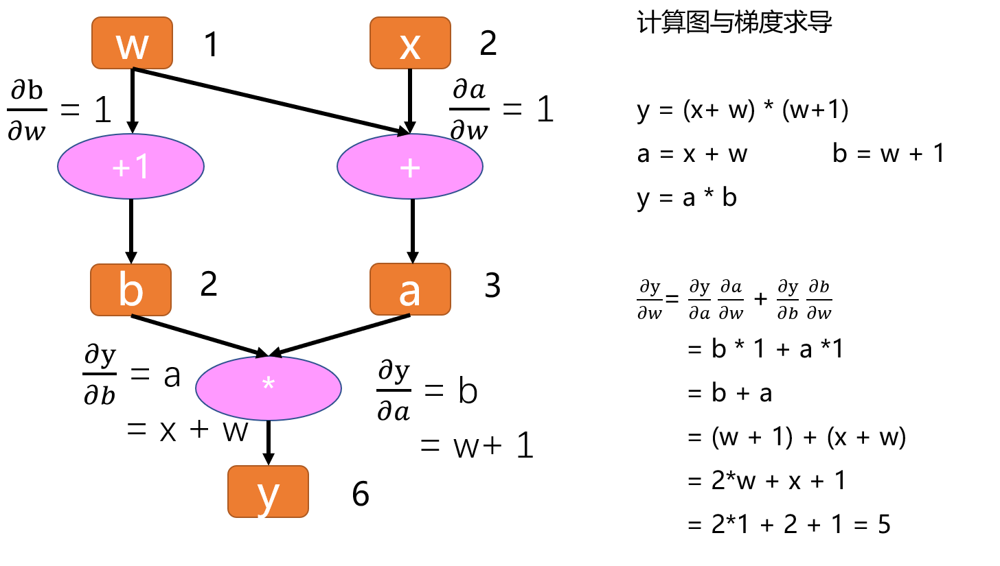

## 一、PyTorch 核心模块

#### 1.2.4 偏导数和梯度
##### (1) 偏导数
设多元函数 $y = f(x_1, x_2, \ldots, x_n)$ 是一个具有 $n$ 个变量的函数。$y$ 关于第 $i$ 个参数 $x_i$ 的**偏导数**（partial derivative）为：

$$\frac{\partial y}{\partial x_i} = \lim_{h \rightarrow 0} \frac{f(x_1, \ldots, x_{i-1}, x_i+h, x_{i+1}, \ldots, x_n) - f(x_1, \ldots, x_i, \ldots, x_n)}{h}.$$

为了计算$\frac{\partial y}{\partial x_i}$，
我们可以简单地将$x_1, \ldots, x_{i-1}, x_{i+1}, \ldots, x_n$看作常数，
并计算$y$关于$x_i$的导数。
对于偏导数的表示，以下是等价的：

$$\frac{\partial y}{\partial x_i} = \frac{\partial f}{\partial x_i} = f_{x_i} = f_i = D_i f = D_{x_i} f.$$


#### 1.2.5 自动微分
深度学习框架通过自动计算导数，即`自动微分`（automatic differentiation）来加快求导。
实际中，根据设计好的模型，系统会构建一个`计算图`（computational graph），来跟踪计算是哪些数据通过哪些操作组合起来 产生输出。
自动微分使系统能够随后反向传播梯度。这里，`反向传播`（backpropagate）意味着跟踪整个计算图，填充关于每个参数的偏导数。

##### (1) 计算图概念
计算图是一种描述运算的“语言”，由节点（Node）和边（Edge）组成：
- **节点**表示数据，如标量、向量、矩阵、张量等；
- **边**表示运算，如加法、减法、乘法、除法、卷积、ReLU 等。

计算图的作用是记录节点和边的信息，从而方便地完成自动求导。

举个例子，假设有一个计算过程：
```
y = (x+ w) * (w+1)
```
将每一步细化为：
```
a = x + w
b = w + 1
y = a * b
```

假设要计算 $y$ 对 $w$ 的导数，在计算图中如何操作呢？<br>

<br>

首先，观察 $w$ 和 $y$ 之间的关系： $w$ 会通过两条路径传递到 $y$ 。一种是通过左边的路径（与 $a$ 相连），另一种是通过右边的路径（与 $b$ 相连）。因此， $y$ 对 $w$ 的偏导数可以通过链式法则表示为：

$$\frac{\partial y}{\partial w} = \frac{\partial y}{\partial a} \cdot \frac{\partial a}{\partial w} + \frac{\partial y}{\partial b} \cdot \frac{\partial b}{\partial w}$$

通过计算图的逐步求导，可以得到最终的结果。

**叶子结点**和**根结点**：
- 在计算图中，所有的偏微分计算所需的数据是基于 $w$ 和 $x$ 的， $w$ 和 $x$ 被称为叶子结点。叶子结点是计算图中的基础结点，它们的数据不是由其他运算生成的，因此它们是整个计算图的基石，不可以轻易修改。
- 最终计算得到的 $y$ 是根结点，类似于树形结构，叶子结点在上，根结点在下。

总结来说，计算图通过层层传递信息和梯度，利用链式法则计算梯度，叶子结点是计算图的基础，而根结点是最终计算结果所在的位置。<br>

计算图根据搭建方式的不同，可以分为静态图和动态图。 **PyTorch** 是典型的动态图，**TensorFlow** 是静态图（但 TensorFlow 2.x 也支持动态图模式）。

1. **运算顺序**：<br>
   **静态图**：先搭建计算图，再进行运算。计算图在运算之前已经完全定义好。<br>
   **动态图**：在运算的同时，计算图是动态生成的。每进行一步计算，计算图会实时构建。

2. **计算图的可变性**：<br>
   **动态图**：计算图在运算过程中是可变动的，可以根据每一步的运算来调整。<br>
   **静态图**：计算图是固定的，不会在运算过程中发生变化。

静态图和动态图优缺点：<br>
1. **动态图优点**：<br>
   **易理解**：程序按照编写的顺序执行，直观且易于调试。<br>
   **灵活性**：可以根据模型的运算结果动态调整计算图，适应不同情况。

2. **静态图优点**：<br>
   **高效性**：在图搭建完成后，可以对计算图进行优化，从而提高运算效率。尤其在GPU时代，这种优化能显著提升性能。<br>
   **适用于大规模生产环境**：静态图常常能够更好地进行并行计算和资源调度。

3. **静态图缺点**：
   **晦涩性**：需要理解 Session、Placeholder 等概念，调试比较困难，灵活性差。

总结来说，静态图和动态图各有优劣，动态图提供了更大的灵活性和易用性，而静态图则在计算效率上有一定优势，适合于大规模部署和优化。

##### (2) Autograd
torch.Tensor 是这个包的核心类。如果设置它的属性 `.requires_grad` 为 True，那么它将会追踪对于该张量的所有操作。
当完成计算后可以通过调用 `.backward()`，来自动计算所有的梯度。这个张量的所有梯度将会自动累加到`.grad`属性。<br>

如果不想要被继续追踪，可以调用`.detach()`将其从追踪记录中分离出来，这样就可以防止将来的计算被追踪。
此外，还可以用`with torch.no_grad()`将不想被追踪的操作代码块包裹起来，这种方法在评估模型的时候很常用，因为在评估模型时，我们并不需要计算可训练参数(requires_grad=True)的梯度。<br>

Tensor和Function互相结合就可以构建一个记录有整个计算过程的**有向无环图(DAG)**。
每个Tensor都有一个`.grad_fn`属性，用来记录创建张量时所用到的运算，在链式求导法则中会使用到，默认是None。<br>

+ 自动求导机制通过有向无环图（directed acyclic graph ，DAG）实现
+ 在DAG中，记录数据（对应tensor.data）以及操作（对应tensor.grad_fn）
+ 操作在pytorch中统称为`Function`，如加法、减法、乘法、ReLU、conv、Pooling等

```
w = torch.tensor([1.], requires_grad=True)
x = torch.tensor([2.], requires_grad=True)
a = torch.add(w, x)
b = torch.add(w, 1)
y = torch.mul(a, b)

 # x是直接创建的，所以它没有grad_fn
print(x.grad_fn)
print(a.grad_fn)
y.backward()
print(w.grad)

None
<AddBackward0 object at 0x7f155bcb23e0>
tensor([5.])
```
grad在反向传播过程中是`累加`的(accumulated)，这意味着每一次运行反向传播，梯度都会累加之前的梯度，所以一般在反向传播之前需把梯度清零。
```
# 注意grad是累加的
y2 = w.sum()
y2.backward()      # 梯度未清零，累加梯度
print(w.grad)

y3 = w.sum()
w.grad.data.zero_()
y3.backward()      # 梯度清零后，x的梯度为1
print(w.grad)

tensor([6.])
tensor([1.])
```

一个模型的运算部分由 `autograd functions` 组成，这些 autograd functions 内部定义了 `forward` 和 `backward` 方法，用以描述前向传播和梯度反传的过程。
通过将多个 autograd function 组合在一起，可以实现整个模型的前向传播和梯度反传。在 torch.autograd.Function 中，Function 类是基类，用户可以继承该类来实现自定义的 autograd function。
自定义的 function 需要重写两个方法：
+ forward：定义前向传播过程，即数据从输入到输出的计算。
+ backward：定义反向传播过程，即根据输出的梯度计算输入的梯度。

通过自定义 autograd function，可以实现更复杂的操作或优化，且能灵活控制梯度的计算过程。下面以指数函数为例：
```
from torch.autograd import Function

class Exp(Function):                    # 此层计算e^x
    @staticmethod
    def forward(ctx, i):                # 模型前向
        result = i.exp()
        ctx.save_for_backward(result)   # 保存所需内容，以备backward时使用，所需的结果会被保存在saved_tensors元组中；
                                        # 此处仅能保存tensor类型变量，若其余类型变量（Int等），可直接赋予ctx作为成员变量，也可以达到保存效果
        return result
    @staticmethod
    def backward(ctx, grad_output):     # 模型梯度反传
        result, = ctx.saved_tensors     # 取出forward中保存的result
        return grad_output * result     # 计算梯度并返回


# 尝试使用
x = torch.tensor([1.], requires_grad=True)  # 需要设置tensor的requires_grad属性为True，才会进行梯度反传
ret = Exp.apply(x)                          # 使用apply方法调用自定义autograd function
print(ret)                                  # tensor([2.7183], grad_fn=<ExpBackward>)
ret.backward()                              # 反传梯度
print(x.grad)                               # tensor([2.7183])
```

##### (3) 标量关于向量的偏导
##### (4) 向量关于向量的偏导


## 参考引用

[1] [《PyTorch实用教程》（第二版）](https://github.com/TingsongYu/PyTorch-Tutorial-2nd/releases/tag/v1.0.0)<br>
[2] [《深入浅出PyTorch》](https://github.com/datawhalechina/thorough-pytorch)<br>
[3] [PyTorch中文文档](https://www.bookstack.cn/read/PyTorch-cn/README.md)<br>
[4] [一览 Pytorch框架](https://zhuanlan.zhihu.com/p/334788042)<br>
[5] [PyTorch的核心模块介绍](https://blog.csdn.net/weixin_38566632/article/details/135442466)<br>
[6] [PyTorch 2.4.0 版本发布](https://pytorch.org/get-started/previous-versions/#v240)<br>
[7] [20天吃掉那只Pytorch](https://github.com/lyhue1991/eat_pytorch_in_20_days/tree/master)<br>
[8] [PyTorch 源码解读之 torch.autograd：梯度计算详解](https://zhuanlan.zhihu.com/p/321449610)<br>
[9] [《动手学深度学习v2》](https://zh-v2.d2l.ai/)<br>
